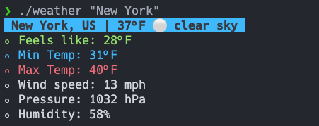

# weather
A simple terminal command made in Go to get the current weather conditions.

## Build and usage
To build and run the program, just run:

```
$ go build
$ ./weather
```

## Weather API
I used the [OpenWeather API](https://openweathermap.org) to query the weather conditions. You will need to obtain your own API key and set it in the `api.go` file before build.

Get your free API key at https://home.openweathermap.org/users/sign_up. Create your account, then go to API keys.

## Output

```
┬ ┬┌─┐┌─┐┌┬┐┬ ┬┌─┐┬─┐
│││├┤ ├─┤ │ ├─┤├┤ ├┬┘
└┴┘└─┘┴ ┴ ┴ ┴ ┴└─┘┴└─
weather 1.0 - Copyright © 2023 Carlos E. Torres (https://github.com/cetorres)
A simple terminal command to get the current weather conditions.

Usage:
        weather <city> [unit]

Units:
        C: Celcius
        F: Fahrenheit (default)

Pro tip:
        You can set environment variables:
        - WEATHER_CITY_NAME="New York"
        - WEATHER_UNIT=C
        And avoid typing parameters everytime.

Uses the OpenWeather API (https://openweathermap.org)
```

### Run with a city


